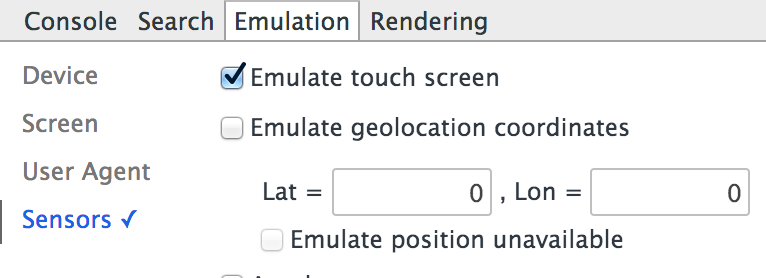

Second demo for [EmberFest14](http://www.slideshare.net/artemsuschev/ember-famous) talk

##How to start
You have to emulate touch events

Just open [index.html](index.html) in browser. Also it is hosted here -- [h1d.github.io/ember-famous-ios-notes-example](http://h1d.github.io/ember-famous-ios-notes-example/#/notes/2).
